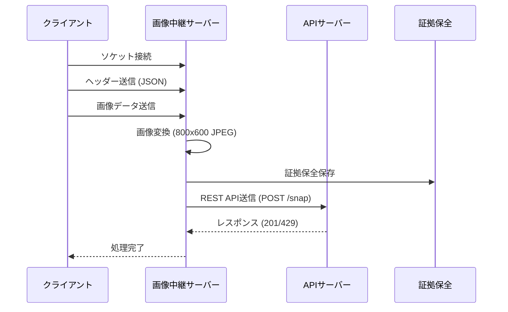
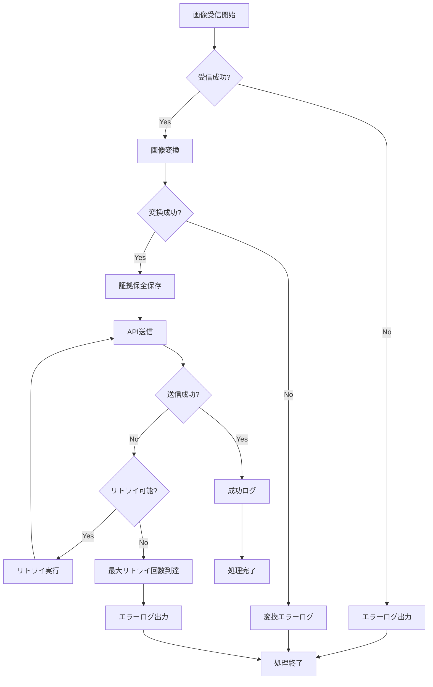
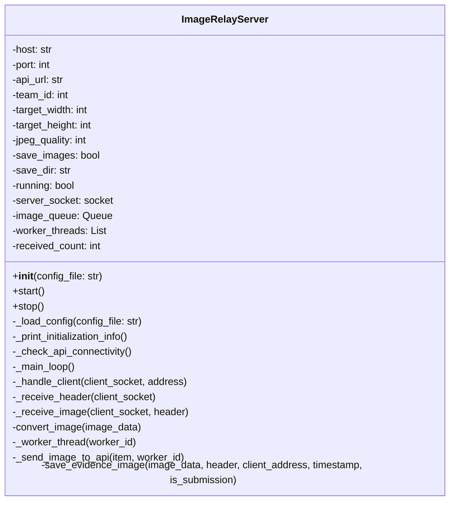
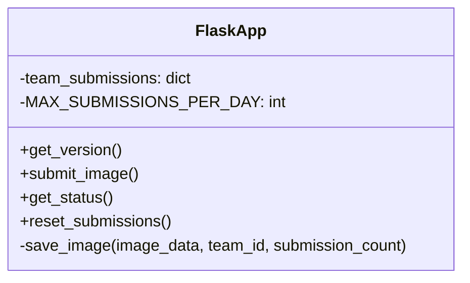

# 画像中継サーバーシステム 設計モデル

## システム概要

ET ROBOT CONTEST用の画像中継サーバーシステムは、ソケット通信で画像を受信し、REST APIで外部サーバーに送信する信頼性の高いシステムです。

## アーキテクチャ

### システム構成図

```
┌─────────────────┐    ┌──────────────────┐    ┌─────────────────┐
│   クライアント    │    │  画像中継サーバー   │    │   APIサーバー    │
│                │    │                │    │                │
│ ┌─────────────┐ │    │ ┌─────────────┐ │    │ ┌─────────────┐ │
│ │ 画像送信     │ │───▶│ ソケット受信  │ │    │ │ 画像受信     │ │
│ │ クライアント  │ │    │ (0.0.0.0:8080)│ │    │ │ エンドポイント │ │
│ └─────────────┘ │    │ └─────────────┘ │    │ │ (/snap)      │ │
│                │    │                │    │ └─────────────┘ │
└─────────────────┘    │ ┌─────────────┐ │    │                │
                       │ │ 画像変換     │ │    │ ┌─────────────┐ │
                       │ │ (800x600)   │ │    │ │ 制限チェック  │ │
                       │ └─────────────┘ │    │ │ (1日2回)     │ │
                       │                │    │ └─────────────┘ │
                       │ ┌─────────────┐ │    │                │
                       │ │ 証拠保全     │ │    │ ┌─────────────┐ │
                       │ │ (画像保存)   │ │    │ │ レスポンス   │ │
                       │ └─────────────┘ │    │ │ (201/429)   │ │
                       │                │    │ └─────────────┘ │
                       │ ┌─────────────┐ │    │                │
                       │ │ REST API    │ │───▶│                │
                       │ │ 送信        │ │    │                │
                       │ └─────────────┘ │    │                │
                       └──────────────────┘    └─────────────────┘
```

## データフロー

### 1. 画像受信フロー



### 2. エラーハンドリングフロー



## クラス設計

### ImageRelayServer クラス



### API Stub Server クラス



## データ構造

### 画像データ構造

```json
{
  "image_data": "bytes",
  "header": {
    "image_size": 12345,
    "metadata": {
      "team_id": 1,
      "timestamp": "2024-01-01T12:00:00Z"
    }
  },
  "timestamp": "2024-01-01T12:00:00Z",
  "client_address": "('192.168.1.100', 12345)",
  "saved_path": "/path/to/evidence/image.jpg"
}
```

### API レスポンス構造

#### 成功時 (HTTP 201)
```json
{
  "status": "Created"
}
```

#### 制限エラー時 (HTTP 429)
```json
{
  "status": "Too Many Requests",
  "message": "Up to 2 images can be accepted."
}
```

## 設定モデル

### ConfigParser 構造

```ini
[socket]
host = 0.0.0.0
port = 8080
buffer_size = 65536

[api]
url = http://localhost:3000/snap
team_id = 1
timeout = 30
max_retries = 3
retry_delay = 1.0

[image]
target_width = 800
target_height = 600
jpeg_quality = 95

[server]
max_workers = 3
log_level = INFO

[evidence]
save_images = True
save_dir = evidence_images
save_metadata = True
```

## セキュリティ考慮事項

### 1. ネットワークセキュリティ
- ファイアウォール設定
- ポート制限
- IPアドレス制限

### 2. データセキュリティ
- 画像データの暗号化
- 証拠保全の整合性
- ログファイルの保護

### 3. アクセス制御
- チームIDによる制限
- 提出回数制限
- タイムアウト設定

## パフォーマンス考慮事項

### 1. スループット
- マルチスレッド処理
- キュー管理
- バッファサイズ最適化

### 2. レイテンシ
- 画像変換の最適化
- ネットワーク遅延の考慮
- リトライ戦略

### 3. リソース使用量
- メモリ使用量の制御
- ディスク容量の管理
- CPU使用率の最適化

## 監視とログ

### 1. ログレベル
- DEBUG: 詳細なデバッグ情報
- INFO: 一般的な処理情報
- WARNING: 警告情報
- ERROR: エラー情報

### 2. 監視項目
- 受信画像数
- 送信成功率
- エラー発生率
- レスポンス時間

### 3. アラート
- 連続エラー発生
- ディスク容量不足
- ネットワーク接続障害
